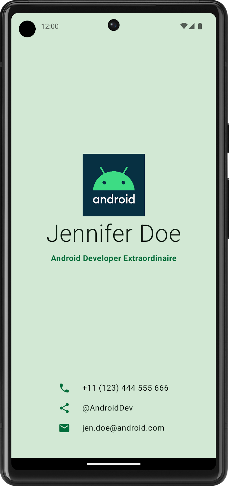

# Lab2：使用 Jetpack Compose 构建名片应用

## 实验背景

Jetpack Compose 是 Android 官方推荐的现代声明式 UI 框架。与传统的 XML 布局方式不同，Compose 允许开发者用 Kotlin 代码直接描述界面的外观与结构，编译器负责将其渲染到屏幕上。

Compose 的核心是**可组合函数（Composable Function）**，通过 `@Composable` 注解标记：

```kotlin
@Composable
fun Greeting(name: String) {
    Text(text = "Hello, $name!")
}
```

布局方面，Compose 提供了两种基本容器：

- `Column`：将子元素**纵向**排列
- `Row`：将子元素**横向**排列

结合 `Image`、`Icon`、`Text` 等组件，以及 `Modifier` 修饰符，即可构建出结构清晰、样式丰富的 UI 界面。

本次实验的目标是使用上述知识，完整实现一张个人电子名片 App。

---

## 实验任务

参考以下名片设计，使用 Jetpack Compose 构建一个 Android 名片应用：



名片分为两个区域：

1. **上半部分**：展示头像（或 Logo 图片）、姓名、职位
2. **下半部分**：展示联系方式，每行包含一个图标和对应的文字

---

## 实验要求

1. 使用 **Kotlin + Jetpack Compose** 实现，在 Android Studio 中新建 Empty Activity 项目
2. 界面需包含以下元素：
   - `Image` 组件：展示头像或自定义 Logo（记得填写 `contentDescription`）
   - `Text` 组件：至少包含姓名和职位两行文字
   - `Icon` 组件：使用 Material Icon 展示联系方式前缀
   - `Row` / `Column` 组件：合理组织布局层次
3. 使用 `Modifier` 对组件进行样式定制，例如：
   - `.padding()`：添加内边距
   - `.fillMaxWidth()` / `fillMaxSize()`：控制填充方式
   - `.size()`：指定图片或图标尺寸
4. 背景颜色需使用自定义颜色，可通过十六进制色值指定，例如：

   ```kotlin
   // Android 绿 #3DDC84
   val androidGreen = Color(0xFF3DDC84)
   ```

5. 在模拟器或真机上运行，确保应用可以正常编译并显示

---

## 代码结构参考

```
app/
└── src/
    └── main/
        ├── java/com/example/businesscard/
        │   └── MainActivity.kt       # 主要 Compose UI 代码
        └── res/
            └── drawable/
                └── logo.png          # 头像或 Logo 图片资源
```

`MainActivity.kt` 核心结构示例（仅供参考，其中 CardTop 和 CardBottom 是 Composable 函数）：

```kotlin
@Composable
fun BusinessCard() {
    Column(
        modifier = Modifier
            .fillMaxSize()
            .background(Color(0xFF073042)),
        horizontalAlignment = Alignment.CenterHorizontally,
        verticalArrangement = Arrangement.SpaceBetween
    ) {
        // 上半部分：头像 + 姓名 + 职位
        CardTop(
            name = "张三",
            title = "Android 开发工程师"
        )
        // 下半部分：联系方式列表
        CardBottom(
            phone = "+86 138-0000-0000",
            email = "zhangsan@example.com",
            handle = "@zhangsan"
        )
    }
}
```

---


### 1. Icon 组件基本用法

```kotlin
Icon(
    imageVector = Icons.Default.Phone,  // 图标资源
    contentDescription = "电话",        // 无障碍描述
    tint = Color(0xFF3DDC84),           // 图标颜色
    modifier = Modifier.size(24.dp)     // 控制尺寸
)
```

**参数说明：**

| 参数 | 类型 | 说明 |
|------|------|------|
| `imageVector` | `ImageVector` | 使用矢量图标（Material Icons） |
| `painter` | `Painter` | 使用 drawable 图片资源 |
| `contentDescription` | `String?` | 无障碍描述，纯装饰性图标传 `null` |
| `tint` | `Color` | 图标颜色，默认跟随主题色 |
| `modifier` | `Modifier` | 控制大小、边距等样式 |

---

### 2. Icons 风格

同一图标有 5 种视觉风格可选：

```kotlin
Icons.Default.Favorite      // 实心（最常用）
Icons.Outlined.Favorite     // 描边
Icons.Rounded.Favorite      // 圆角
Icons.Sharp.Favorite        // 尖角
Icons.TwoTone.Favorite      // 双色
```

---

### 3. 名片场景中的常用图标

```kotlin
Icons.Default.Phone     // 电话
Icons.Default.Email     // 邮件
Icons.Default.Share     // 社交 / 分享
Icons.Default.Person    // 人物头像
Icons.Default.LocationOn // 地址
```

---

### 4. 完整示例：ContactRow

在名片的联系方式区域，每一行由一个图标和一段文字组成，封装成 `ContactRow` 组件：

```kotlin
import androidx.compose.material.icons.Icons
import androidx.compose.material.icons.filled.Email
import androidx.compose.material.icons.filled.Phone
import androidx.compose.material.icons.filled.Share
import androidx.compose.ui.graphics.vector.ImageVector

// 单行联系方式：图标 + 文字
@Composable
fun ContactRow(
    icon: ImageVector,
    info: String
) {
    Row(
        modifier = Modifier
            .fillMaxWidth()
            .padding(vertical = 12.dp, horizontal = 40.dp),
        verticalAlignment = Alignment.CenterVertically
    ) {
        Icon(
            imageVector = icon,
            contentDescription = null,       // 旁边已有文字说明，传 null 即可
            tint = Color(0xFF3DDC84),        // 与整体配色统一
            modifier = Modifier.size(24.dp)
        )
        Spacer(modifier = Modifier.width(16.dp))
        Text(
            text = info,
            color = Color.White,
            fontSize = 16.sp
        )
    }
}

// CardBottom 中调用
@Composable
fun CardBottom(phone: String, email: String, handle: String) {
    Column(
        modifier = Modifier
            .fillMaxWidth()
            .padding(bottom = 40.dp)
    ) {
        Divider(color = Color.Gray.copy(alpha = 0.5f))
        ContactRow(icon = Icons.Default.Phone, info = phone)
        Divider(color = Color.Gray.copy(alpha = 0.5f))
        ContactRow(icon = Icons.Default.Email, info = email)
        Divider(color = Color.Gray.copy(alpha = 0.5f))
        ContactRow(icon = Icons.Default.Share, info = handle)
    }
}
```

---

### 5. 使用 drawable 图片作为图标

如果想用自己下载的图标（如 iconfont.cn 的 SVG 转换后的 xml），使用 `painter` 参数：

```kotlin
// 阿里巴巴矢量图标库 : https://www.iconfont.cn/ 
//先把 SVG 通过 Android Studio -> New -> Vector Asset 导入为 drawable
Icon(
    painter = painterResource(id = R.drawable.ic_wechat),
    contentDescription = "微信",
    tint = Color(0xFF3DDC84),
    modifier = Modifier.size(24.dp)
)
```

---

## 提示

- 可以用 `Spacer` 组件显式控制元素间的间距，比直接用 padding 更清晰
- `horizontalArrangement` 和 `verticalAlignment` 参数可以调整子元素在 `Row` / `Column` 中的对齐方式，多尝试不同取值
- `Icon` 组件的 `tint` 参数可以修改图标颜色，使其与整体配色风格统一
- 若图片仅用于装饰、旁边已有文字说明，`contentDescription` 可设为 `null`
- 完成后可以把自己的真实照片或个人 Logo 放进去，分享给朋友！

---

## 提交要求

在自己的文件夹下新建 `Lab2/` 目录，提交以下文件：

```
学号姓名/
└── Lab2/
    ├── MainActivity.kt     # 核心源代码（命名规范，结构合理）
    ├── screenshot.png      # 应用运行截图 （严禁使用手机拍屏幕的方式来获取截图）
    └── report.md           # 简要说明（布局思路、遇到的问题与解决方式）
```

`report.md` 需包含：
- 你的名片展示了哪些个人信息
- 布局结构简要说明（用了哪些 Composable，如何嵌套）
- 遇到的问题和解决过程

---

## 截止时间

**2026-3-31**，届时关于 Lab2 的 PR 请求将不会被合并。
