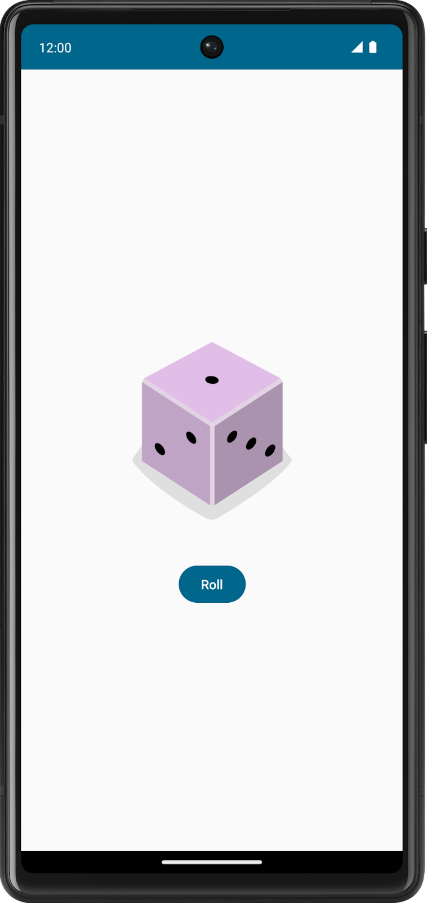

# Lab4：Dice Roller 交互应用与 Android Studio 调试

## 实验背景

在前面的 Compose 入门实验中，你已经接触了 `Text`、`Image`、`Row`、`Column` 等基础组件。本次实验将进一步完成一个真正可交互的 Android 应用：用户点击按钮后，骰子点数会随机变化，界面中的图片也会随之更新。

除了实现功能，本实验还要求你使用 Android Studio 自带调试器观察程序运行过程。你需要学会设置断点、单步执行、查看变量值，并理解 Compose 状态是如何驱动界面刷新的。

---

## 前提条件

- 已安装 Android Studio
- 能够创建并运行 Empty Activity 项目
- 熟悉 Kotlin 基础语法
- 了解 Jetpack Compose 中 `@Composable` 函数的基本写法
- 已完成前面的 Compose 基础实验

---

## 实验目标

完成本实验后，你应能够：

- 使用 Compose 构建一个带按钮和图片的交互式界面
- 使用 `remember` 与 `mutableStateOf()` 保存并更新界面状态
- 根据随机结果切换不同的 drawable 资源
- 在 Android Studio 中设置断点并启动调试
- 使用 `Resume Program`、`Step Into`、`Step Over`、`Step Out` 等基本调试功能
- 在调试窗口中观察变量值变化，理解状态更新与界面重组的关系

---

## 实验任务

本次实验分为两个部分，必须全部完成。

### 任务一：创建交互式 Dice Roller 应用

新建一个 **Empty Activity** 项目，项目名称建议为 `DiceRoller`，使用 **Kotlin + Jetpack Compose** 完成一个掷骰子应用。

应用界面至少需要包含以下元素：

1. 一个用于显示骰子结果的 `Image`
2. 一个用于触发掷骰子的 `Button`
3. 合理的布局容器，例如 `Column`

应用的核心交互要求如下：

- 初始进入应用时，显示默认骰子图片
- 用户点击 `Roll` 按钮后，程序随机生成 `1~6` 的整数
- 根据点数切换显示对应的骰子图片
- 界面刷新必须由 Compose 状态驱动，而不是手动刷新视图

参考图：



### 任务二：使用 Android Studio 调试程序

在完成 Dice Roller 应用后，使用 Android Studio 调试器对程序进行检查，并完成以下操作：

1. 在关键代码处设置断点
2. 使用 **Debug 'app'** 模式启动应用
3. 使用 `Resume Program` 继续运行程序
4. 使用 `Step Into` 进入函数调用
5. 使用 `Step Over` 逐行执行代码
6. 使用 `Step Out` 返回上一层调用位置
7. 在 Variables 窗格中观察状态变量的值变化

---

## 实验要求

### 一、Dice Roller 功能要求

1. 使用 Compose 编写界面，不允许使用 XML 布局
2. 至少定义一个独立的可组合函数，例如 `DiceRollerApp()`
3. 使用 `Button` 处理点击事件
4. 使用 `Image` 展示骰子图片，并正确填写 `contentDescription`
5. 使用 `remember { mutableStateOf(...) }` 保存当前骰子点数
6. 点击按钮时，通过随机数更新状态
7. 通过 `when` 表达式或等价逻辑，将点数映射到不同图片资源
8. 在模拟器或真机中正常运行，界面无崩溃

### 二、调试要求

1. 至少在以下两个位置之一设置断点：
   - `onCreate()` 中调用 `DiceRollerApp()` 的位置
   - 根据点数设置 `imageResource` 的位置
2. 至少演示一次 `Step Into`
3. 至少演示一次 `Step Over`
4. 至少演示一次 `Step Out`
5. 截图记录调试窗口，能清楚看到断点或变量信息
6. 在实验报告中说明你观察到的变量变化现象

---

## 实现提示

### 1. 推荐界面结构

```kotlin
@Composable
fun DiceRollerApp() {
    Column(
        modifier = Modifier.fillMaxSize(),
        horizontalAlignment = Alignment.CenterHorizontally,
        verticalArrangement = Arrangement.Center
    ) {
        DiceWithButtonAndImage()
    }
}
```

### 2. 使用状态保存骰子点数

可将当前结果保存在一个 Compose 状态变量中：

```kotlin
var result by remember { mutableStateOf(1) }
```

当 `result` 的值发生变化时，Compose 会自动触发重组，界面会更新为新的图片。

### 3. 点击按钮后生成随机点数

你可以在按钮点击事件中更新状态：

```kotlin
Button(onClick = { result = (1..6).random() }) {
    Text(text = "Roll")
}
```

也可以单独封装一个函数，例如：

```kotlin
fun rollDice(): Int {
    return Random.nextInt(1, 7)
}
```

### 4. 根据点数切换图片

建议将 6 张骰子图片导入到 `res/drawable/` 目录，并使用 `when` 表达式选择资源：

```kotlin
val imageResource = when (result) {
    1 -> R.drawable.dice_1
    2 -> R.drawable.dice_2
    3 -> R.drawable.dice_3
    4 -> R.drawable.dice_4
    5 -> R.drawable.dice_5
    else -> R.drawable.dice_6
}
```

然后通过 `painterResource()` 显示图片：

```kotlin
Image(
    painter = painterResource(imageResource),
    contentDescription = result.toString()
)
```

### 5. 调试器操作建议

根据官方教程，建议按下面顺序练习调试：

1. 在 `DiceRollerApp()` 调用处设置断点
2. 使用 **Debug 'app'** 启动应用
3. 当程序停在断点时，先观察当前执行位置
4. 点击 `Step Into`，进入对应的可组合函数
5. 再使用 `Step Over` 按行执行
6. 使用 `Step Out` 返回上一层调用位置
7. 在 `imageResource` 赋值处保留断点，点击按钮后查看变量值变化

如果你将结果状态定义为：

```kotlin
var result by remember { mutableStateOf(1) }
```

那么在调试窗口中，可能会看到类似 `result$delegate` 的变量名。这是因为该状态通过 Kotlin 委托属性实现，属于正常现象。

---

## 代码结构参考

```text
app/
└── src/
    └── main/
        ├── java/com/example/diceroller/
        │   └── MainActivity.kt
        └── res/
            └── drawable/
                ├── dice_1.png
                ├── dice_2.png
                ├── dice_3.png
                ├── dice_4.png
                ├── dice_5.png
                └── dice_6.png
```

---

## 提交要求

在自己的文件夹下新建 `Lab4/` 目录，提交以下文件：

```text
学号姓名/
└── Lab4/
    ├── MainActivity.kt          # 核心源代码
    ├── screenshot_app.png       # 应用运行截图
    ├── screenshot_debugger.png  # 调试窗口截图
    └── report.md                # 实验报告
```

如果你对项目结构做了拆分，也可以补充提交其他必要文件，例如：

- `DiceRollerApp.kt`
- `ui/theme/` 下的主题文件
- 自定义图片资源

---

## report.md 撰写要求

`report.md` 至少包含以下内容：

1. 你的应用界面结构说明
2. 你如何使用 Compose 状态保存骰子结果
3. 你如何根据点数切换图片资源
4. 你设置了哪些断点，分别观察了什么
5. `Step Into`、`Step Over`、`Step Out` 的使用体会
6. 你遇到的问题与解决过程

建议报告中附上简短结论，例如：

- 为什么按钮点击后图片能够自动刷新
- 调试器中看到的变量值与界面结果是否一致

---

## 验收标准

满足以下条件可视为完成实验：

- 应用可以正常运行
- 点击按钮后骰子图片会发生变化
- 使用了 Compose 状态管理，而不是写死图片
- 能够展示至少一张调试器截图
- 报告中能说明断点位置、变量变化和调试过程


---

## 截止时间

**2026-04-17**，届时关于 Lab4 的 PR 请求将不会被合并。

